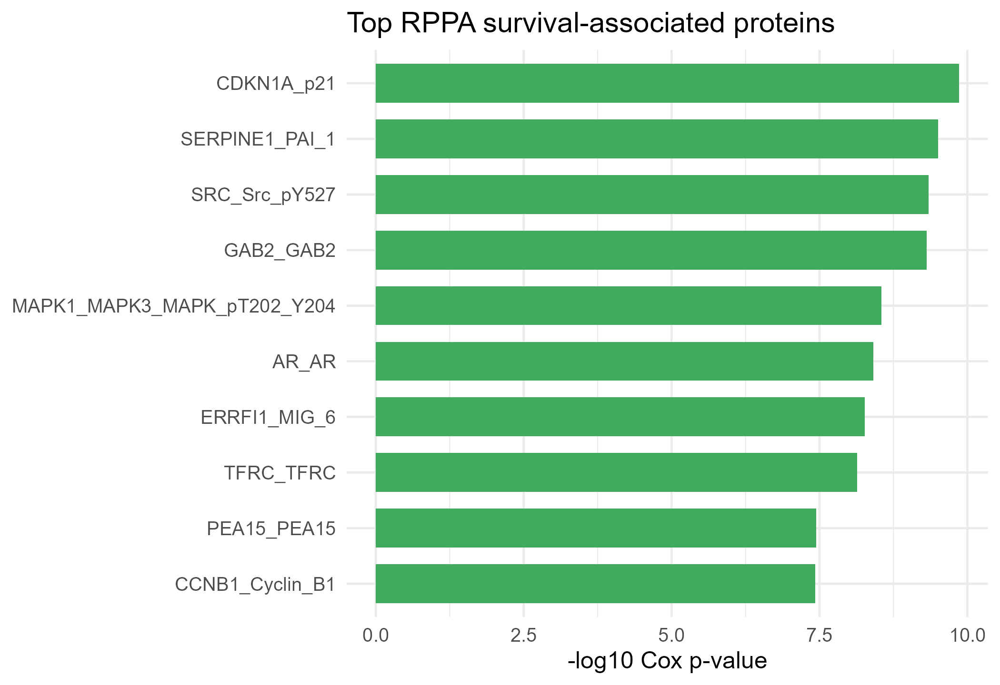
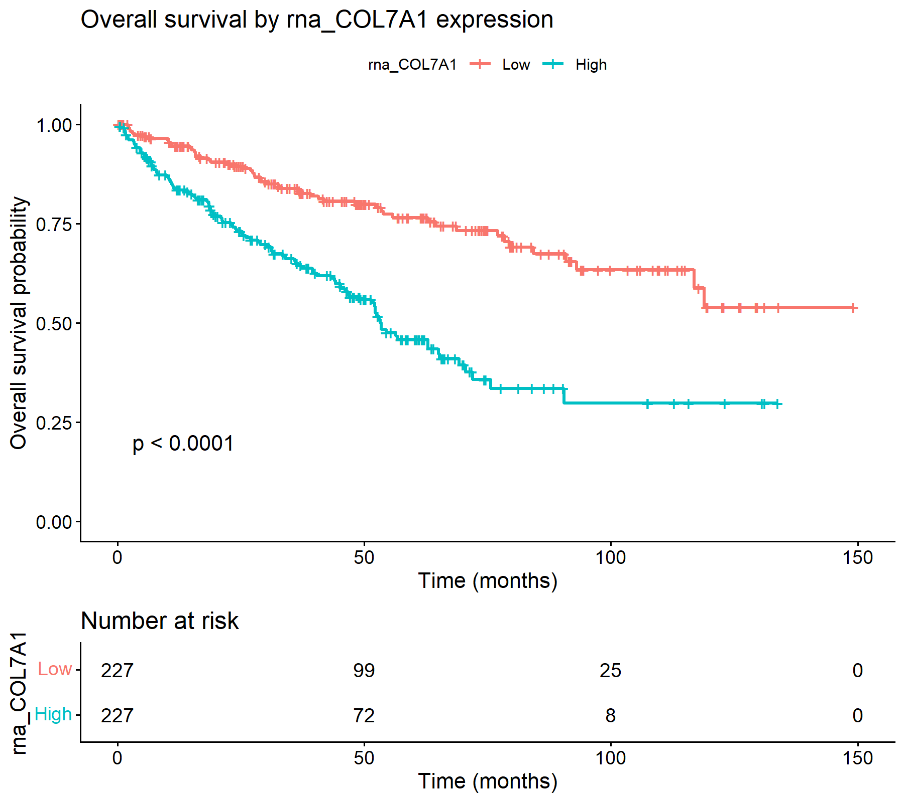
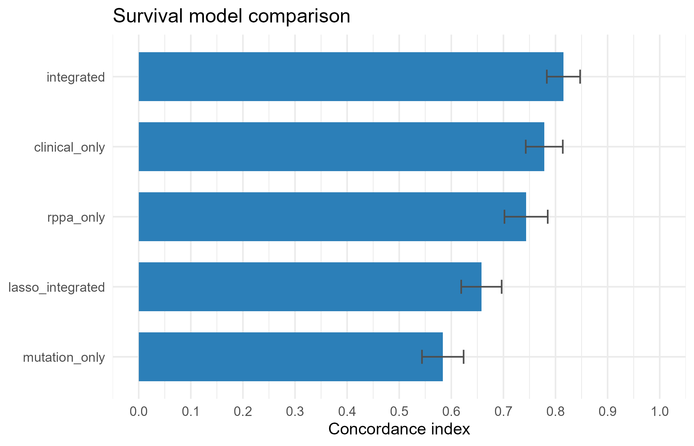

# Integrating Clinical, Proteomic, and Mutation Data for Survival Analysis in TCGA KIRC

## Background

High-throughput omics data can be used to study cancer because it captures molecular variation that is not visible from clinical variables alone. Clinical variables such as age and tumour stage describe the patient and disease presentation, while omics layers such as protein expression and somatic mutation data can reveal biological pathways associated with tumour behaviour. Integrating these data types can therefore help identify whether molecular features add useful information to standard clinical survival models.

This mini-project focuses on kidney renal clear cell carcinoma (KIRC), the most common subtype of renal cell carcinoma. The dataset is the TCGA KIRC PanCancer Atlas cohort downloaded from cBioPortal. The analysis integrates three data layers: clinical survival data, RPPA protein expression z-scores, and somatic mutation calls for selected clear cell renal cell carcinoma driver genes. The selected mutation genes were `VHL`, `PBRM1`, `BAP1`, `SETD2`, `KDM5C`, `MTOR`, `PTEN`, `TSC1`, and `TSC2`, chosen because they are established kidney cancer driver or pathway genes.

The main question was: **Can clinical variables, RPPA protein expression, and selected kidney cancer driver mutations help explain overall survival in TCGA clear cell renal cell carcinoma?** This was addressed by preparing and integrating the data, selecting informative RPPA protein features using univariable Cox regression, and comparing clinical-only, omics-only, and integrated Cox survival models.

## Results

### Data integration and cohort summary

The pipeline integrated clinical, RPPA, and mutation data by sample identifier. The final integrated dataset contained **455 samples from 455 patients**, with **159 death events** and **296 censored observations**. Median follow-up was **38.6 months**. Median overall survival was not reached in the full integrated cohort, meaning that estimated survival did not drop below 50% during the observed follow-up period.


The Kaplan-Meier curve shows the overall survival distribution for the integrated cohort. This provides a baseline view of survival before modelling associations with clinical or molecular features.

### Clinical survival model

A baseline Cox proportional hazards model was fitted using age, sex, pathological stage, and grade. Age and stage were the strongest clinical predictors. Age had a hazard ratio greater than 1, indicating increased mortality risk with increasing age. Stage also showed a strong association with survival, consistent with later-stage disease having poorer prognosis.

The clinical model produced a concordance index of **0.778**, indicating reasonably good discrimination. However, the model produced a warning that some grade coefficients may be unstable or infinite. This is likely due to sparse grade categories and should be interpreted as a limitation rather than as a reliable grade effect estimate.

### RPPA feature selection

RPPA protein features were screened using univariable Cox proportional hazards models. The top 10 proteins were selected for interpretable downstream modelling. The most survival-associated RPPA feature was **CDKN1A/p21**, with a hazard ratio of **1.595** and p-value **1.39e-10**. This suggests that higher CDKN1A/p21 protein expression was associated with increased hazard in this cohort.

The selected RPPA features were:

| RPPA feature | Hazard ratio | BH-adjusted p-value |
|---|---:|---:|
| CDKN1A_p21 | 1.595 | 2.34e-08 |
| SERPINE1_PAI_1 | 1.535 | 2.34e-08 |
| SRC_Src_pY527 | 0.647 | 2.34e-08 |
| GAB2_GAB2 | 0.539 | 2.34e-08 |
| MAPK1_MAPK3_MAPK_pT202_Y204 | 0.601 | 1.08e-07 |
| AR_AR | 0.644 | 1.23e-07 |
| ERRFI1_MIG_6 | 0.529 | 1.47e-07 |
| TFRC_TFRC | 1.554 | 1.74e-07 |
| PEA15_PEA15 | 1.588 | 7.06e-07 |
| CCNB1_Cyclin_B1 | 1.421 | 7.06e-07 |



For visual interpretation, the strongest RPPA feature, CDKN1A/p21, was split into high and low expression groups by the median expression value and plotted with Kaplan-Meier curves.



This dichotomised plot is useful for visualisation, but the Cox model using the continuous RPPA value is more statistically appropriate because dichotomising continuous variables loses information.

### Survival model comparison

The main comparison tested whether integrating clinical and omics features improved survival discrimination. Models were compared using the concordance index, where higher values indicate better ranking of patients by survival risk.

| Model | Samples | Events | Predictors | C-index |
|---|---:|---:|---:|---:|
| Integrated Cox | 451 | 158 | 23 | 0.815 |
| Clinical-only Cox | 451 | 158 | 4 | 0.778 |
| RPPA-only Cox | 455 | 159 | 10 | 0.744 |
| LASSO integrated Cox | 451 | 158 | 27 | 0.738 |
| Mutation-only Cox | 455 | 159 | 9 | 0.584 |



The integrated Cox model performed best, with a C-index of **0.815**, compared with **0.778** for the clinical-only model. This suggests that selected RPPA and mutation features added survival-relevant information beyond standard clinical variables. The RPPA-only model also showed informative signal, while the mutation-only model had weaker discrimination. The LASSO model selected a sparse set of predictors at `lambda.1se`, mainly retaining the stage effect, which supports the importance of clinical stage and shows that penalisation can reduce the integrated model to a simpler predictor set.

## Conclusion

This analysis demonstrates that integrating clinical and omics data can improve survival modelling in TCGA KIRC. Clinical stage and age were important predictors, but selected RPPA protein features also showed strong associations with overall survival. The best-performing model was the integrated Cox model combining clinical variables, selected RPPA proteins, and driver-gene mutation features. These results support the usefulness of multi-omics integration for identifying survival-associated molecular signals, while also showing important limitations: the analysis is retrospective, feature selection was performed within the same cohort used for model comparison, and sparse clinical categories such as grade can produce unstable Cox estimates.

## Methods and Code

All analysis code is provided as commented R scripts in the `R/` directory. The full workflow can be run from the project root with:

```r
source("R/run_analysis.R")
```

The workflow is modular:

| Script | Purpose |
|---|---|
| `00_setup.R` | Loads packages and defines project file paths. |
| `01_load_data.R` | Loads local cBioPortal clinical, RPPA, CNA, and mutation files. |
| `02_prepare_clinical.R` | Prepares survival time, event status, age, sex, stage, and grade. |
| `03_prepare_rppa.R` | Reshapes RPPA data from feature-by-sample format to sample-by-feature format. |
| `04_prepare_mutations.R` | Creates binary mutation features for selected ccRCC driver genes. |
| `05_integrate_data.R` | Integrates clinical, RPPA, and mutation data by sample ID. |
| `06_quick_survival_check.R` | Creates cohort survival summaries, Kaplan-Meier plot, and clinical Cox model. |
| `07_feature_selection.R` | Performs univariable Cox screening of RPPA proteins and selects the top 10 features. |
| `08_survival_models.R` | Fits clinical-only, mutation-only, RPPA-only, integrated Cox, and LASSO Cox models. |
| `09_results_figures.R` | Saves report-ready figures and result tables. |

Survival outcomes were modelled as overall survival using `Surv(os_months, os_event)`, where `os_event = 1` indicates death and `os_event = 0` indicates censoring. Cox proportional hazards models were fitted using the `survival` package. RPPA feature selection used univariable Cox regression and Benjamini-Hochberg adjusted p-values. Model performance was evaluated using the concordance index. Figures were generated with `ggplot2` and `survminer`.

Generated result tables are saved in `results/`, and generated figures are saved in `figures/`.
